# White Paper — Figures (Mermaid source)

**Level:** 🧭 NORTH STAR · All diagrams are text-based (Mermaid) so they are versionable and render
in most Markdown viewers. Each figure notes the chapter it belongs to.

---

## F1 — Valuation → Representation → Decision Intelligence (Ch. 1)

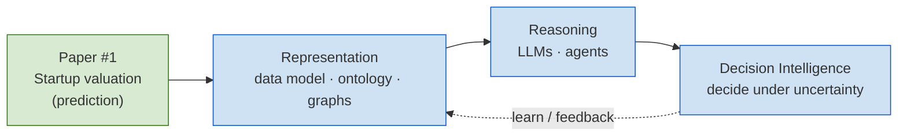
*Caption: the programme reframes a completed prediction result as the first step toward a
representation-and-decision layer. Valuation is the entry point, not the destination.*

---

## F2 — Competitive landscape: coverage × reasoning-readiness (Ch. 2)

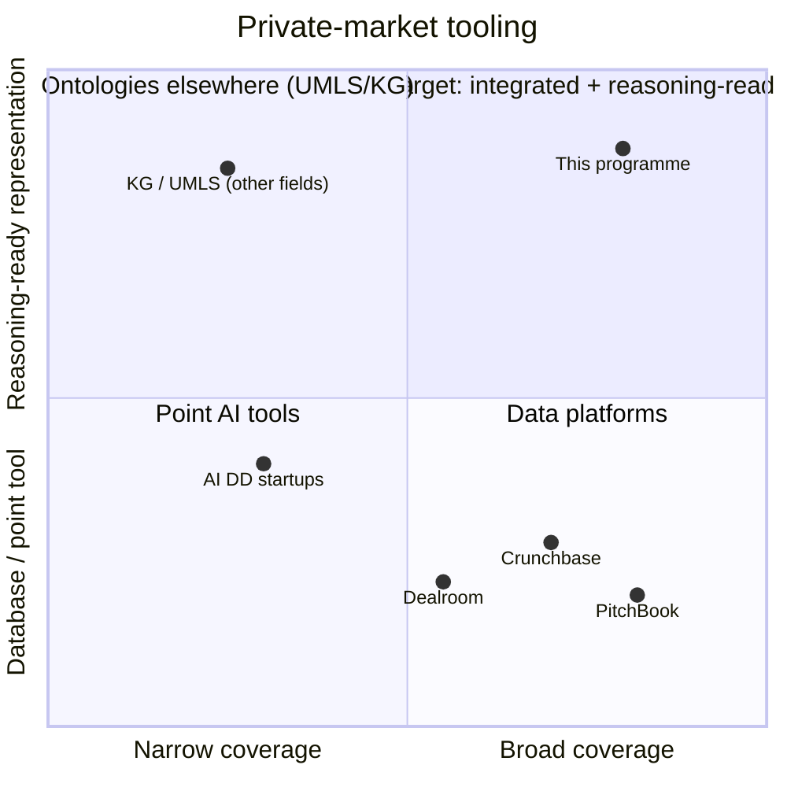
*Caption: incumbents are broad-but-flat (databases) or narrow point tools; reasoning-ready
representation exists in other fields but not in private markets. The target sits top-right.*

---

## F3 — Research questions → chapters (Ch. 3)

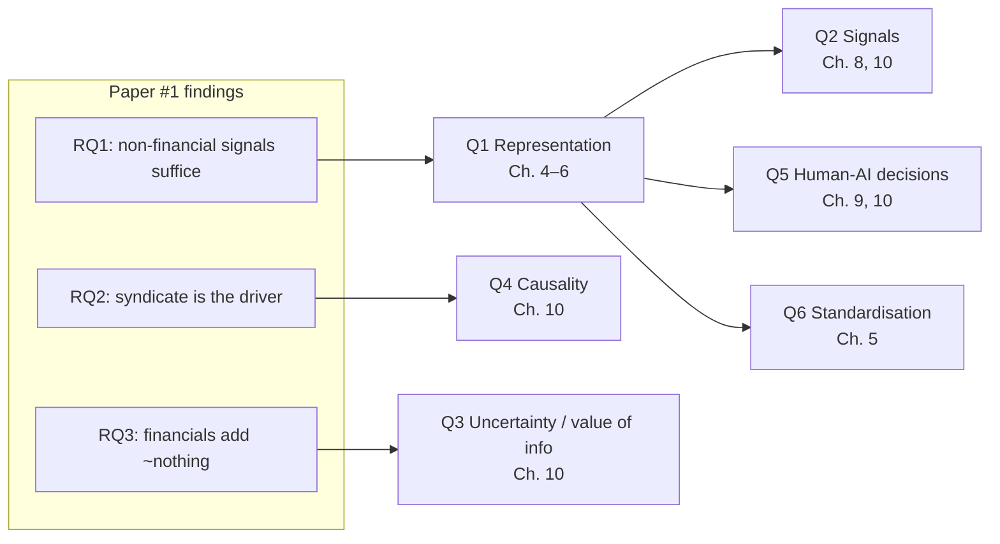
*Caption: each narrow, answered paper question opens a broad programme question. Representation
(Q1) is the hinge the rest depend on.*

---

## F4 — The six-layer Private Market Data Model (Ch. 4)

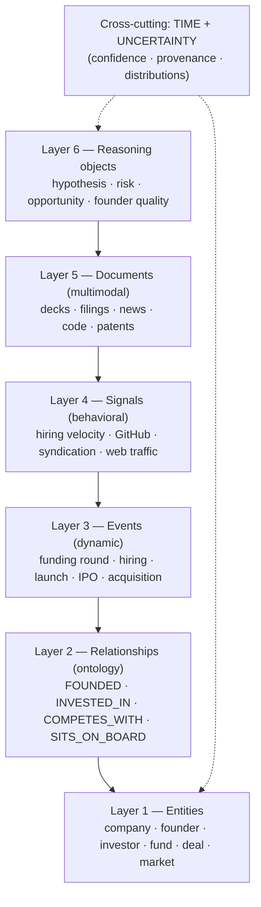
*Caption: a private investment as a dynamic system, represented in six layers, with time and
uncertainty running through all of them.*

---

## F5 — Ontology: entities & relationships (Ch. 5)

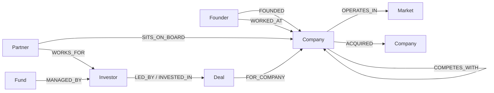
*Caption: the relationship layer as a property graph. The syndicate structure (INVESTED_IN
co-participation + LED_BY) is where the paper's dominant signal lives.*

---

## F6 — Knowledge Graph + Digital Twins + Decision Graph (Ch. 6)

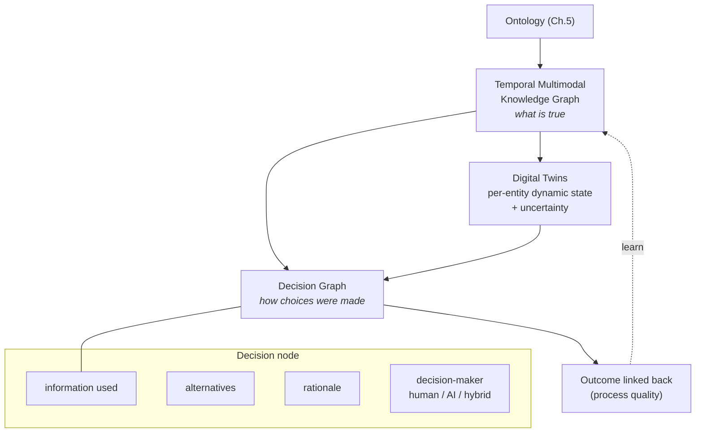
*Caption: the world model (knowledge graph + twins) plus the record of action (decision graph)
close the loop represent → reason → decide → observe → learn.*

---

## F7 — Data ingestion architecture (Ch. 7)

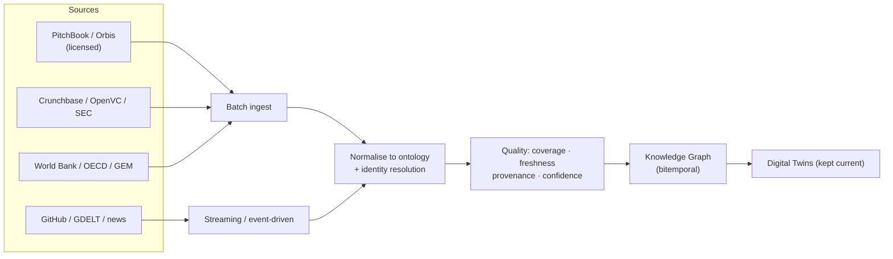
*Caption: batch for bulk sources, streaming for the dynamic layer; everything normalised to the
ontology with identity resolution and quality/provenance attached.*

---

## F8 — Representation-learning stages (Ch. 8)

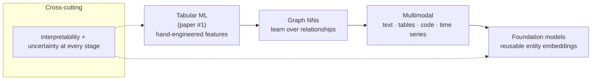
*Caption: each stage is motivated by the previous result and reduces bespoke feature engineering
while growing a shared representation.*

---

## F9 — Multi-agent investment system (Ch. 9)

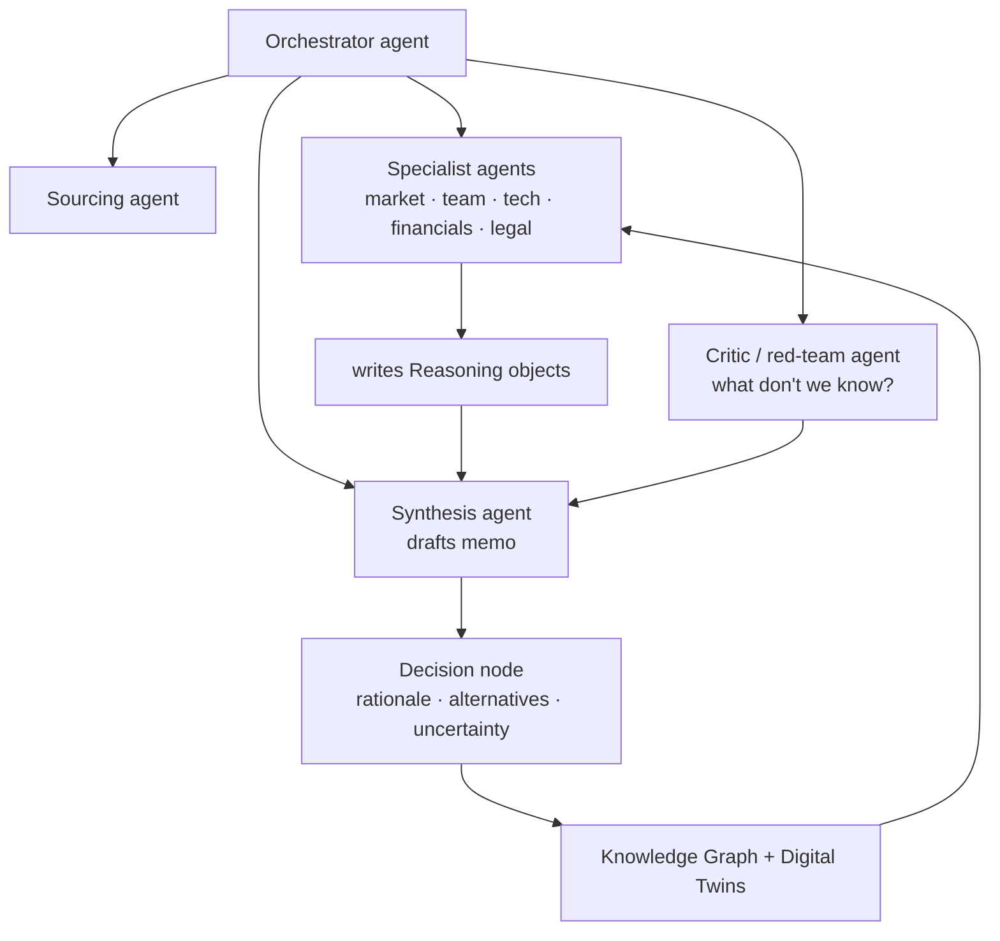
*Caption: grounded, human-augmenting agents that read the represented world and write reasoning
objects and an auditable decision node — with a critic agent enforcing uncertainty.*

---

## F10 — The decision object (Ch. 10)

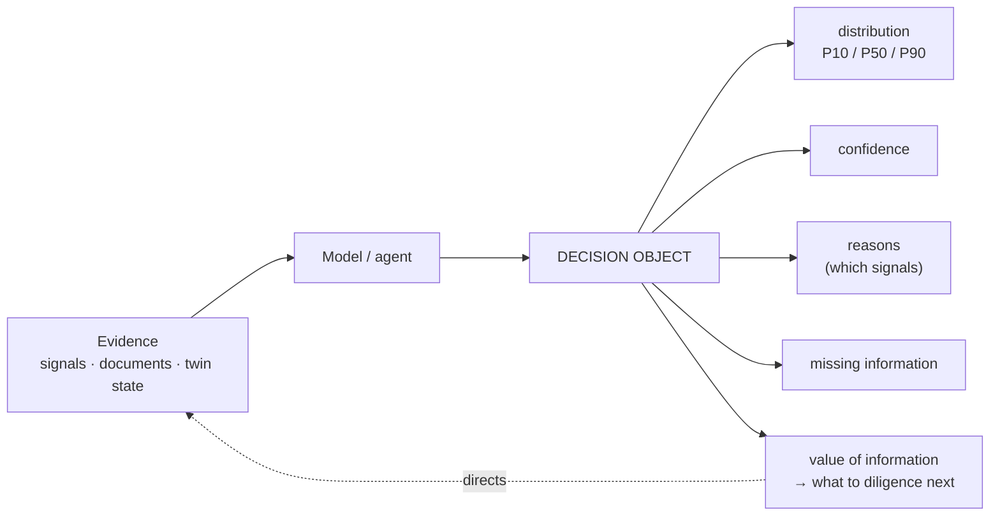
*Caption: never a point estimate. Value-of-information turns the output into an active
recommendation about what to find out next.*

---

## F11 — Paper × asset dependency graph (Ch. 11)

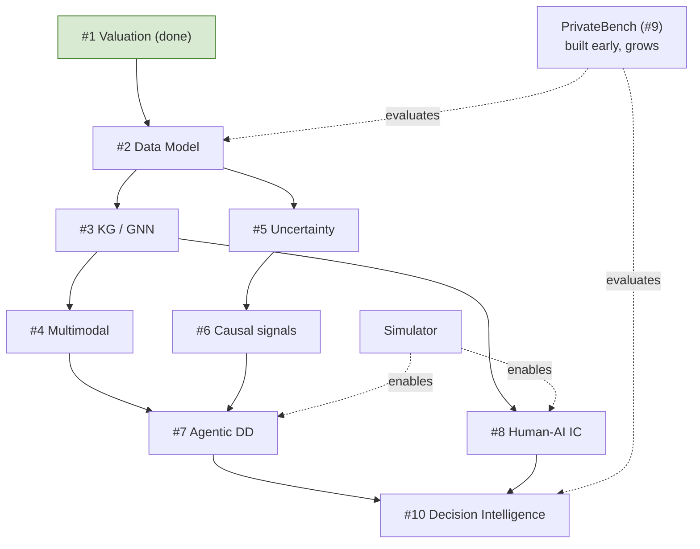
*Caption: one question in layers. A 4-year PhD draws #2–#4; PrivateBench and the Simulator are the
enabling assets.*

---

## F12 — Six-layer software architecture (Ch. 12)

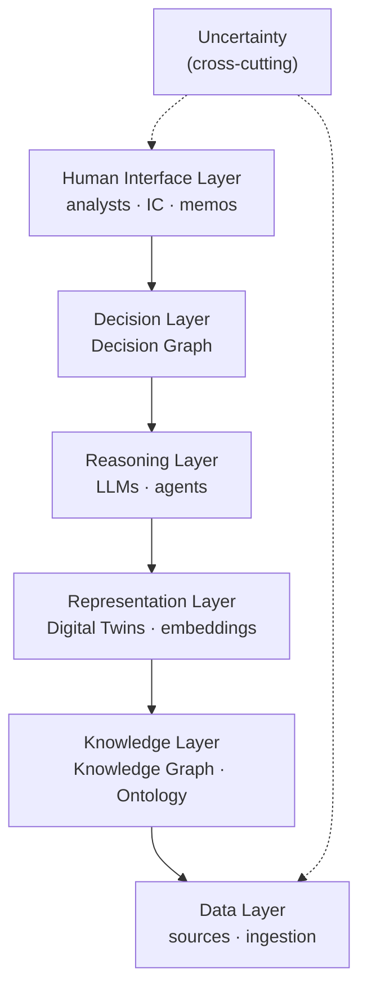
*Caption: the engineering counterpart to the science; uncertainty runs through every layer.*

---

## F13 — Product evolution V1 → V4 (Ch. 13)

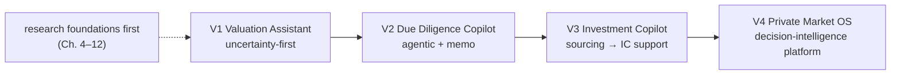
*Caption: products are productised layers of the architecture; each depends on the research being
done first. Science first, company last.*

---

## Rendering notes
- Mermaid renders in GitHub, VS Code (with a Mermaid extension), Obsidian, and many viewers.
- `quadrantChart` (F2) needs a recent Mermaid version; if it fails to render, a simple 2×2 table is
  a fallback.
- These are schematic. Publication-quality versions (for a real paper/grant) may be redrawn in a
  vector tool, but the Mermaid source stays the version-controlled source of truth.
